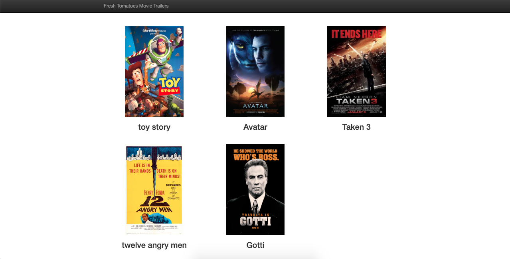

# Udacity_Python_Project
> Apply Python Library to Build Movie Website with all of your favorite Movies, and if you click on one of them its trailer will play.

we have used a **class** called Movie, which will allow us to create multiple instances of itself, instances like Toy Story and Avatar

